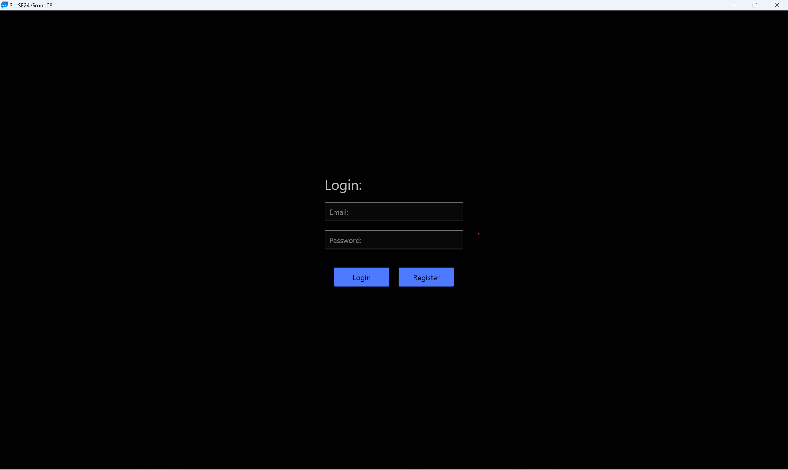
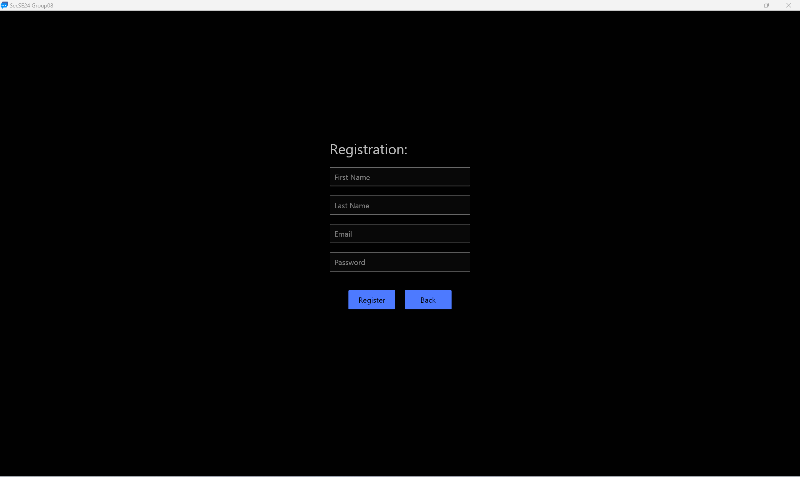
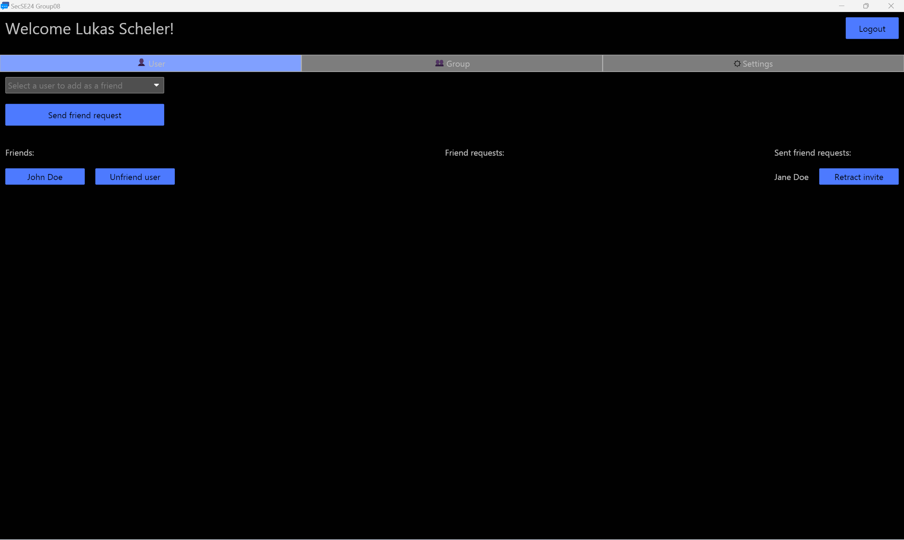
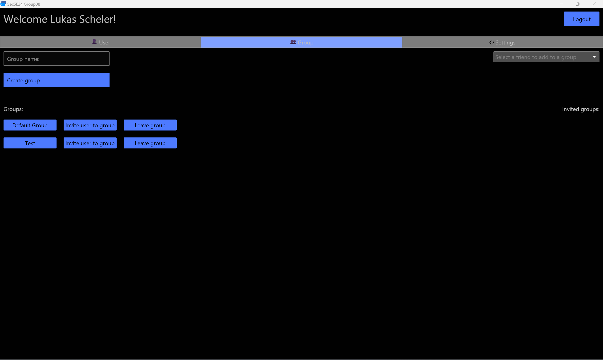
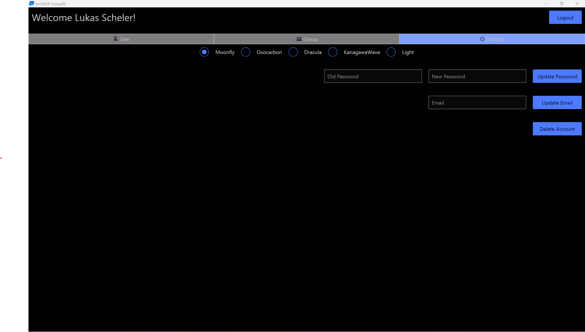
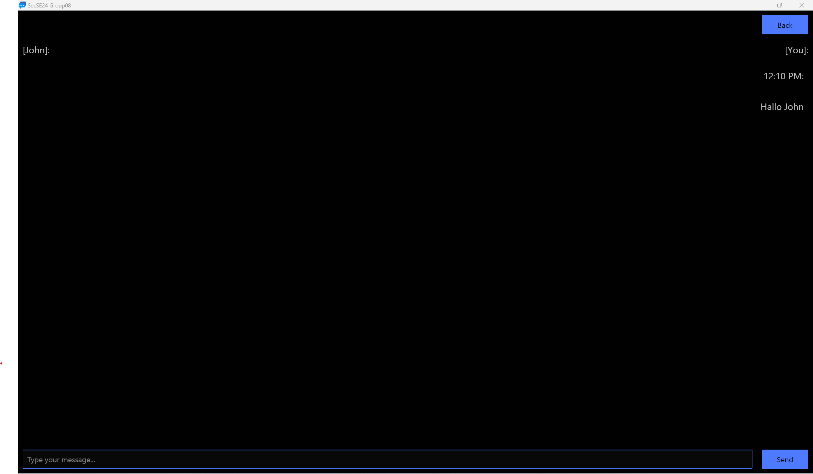

[](https://github.com/LukasTrust/rust_simple_chat_application/actions?query=workflow%3A%22Rust+CI%22)
[](./coverage/cobertura.xml)
[](https://github.com/LukasTrust/rust_simple_chat_application/releases/latest)

# **Chat-App**

Diese Chat-App wurde im Rahmen des Fachs Secure Software Engineering an der Hochschule für angewandte Wissenschaften Coburg entwickelt. Die Anwendung ermöglicht es Nutzern, in Echtzeit Nachrichten zu senden und zu empfangen, wobei besonderer Wert auf Datensicherheit und den Schutz der Privatsphäre der Nutzer gelegt wird. Die gesamte Kommunikation wird über eine Datenbank abgewickelt, das heißt, es gibt keinen Server, der sich um die Verwaltung kümmert. Mir sind die Nachteile dieses Vorgehens bekannt, daher könnte in der Zukunft ein Umbau auf das Client-Server-Modell in Betracht gezogen werden.

## Inhaltsverzeichnis
- [Screenshots](#screenshots)
  - [Login-Seite](#login-seite)
  - [Registrierungs-Seite](#registrierungs-seite)
  - [User-Tab](#user-tab)
  - [Group-Tab](#group-tab)
  - [Einstellungen-Tab](#einstellungen-tab)
  - [Chat-Fenster](#chat-fenster)
- [Setup](#setup)

## **Screenshots**

Hier sind einige Screenshots der Anwendung:

### **Login-Seite**


### **Registrierungs-Seite**


### **User-Tab**


### **Group-Tab**


### **Einstellungen-Tab**


### **Chat-Fenster**


## **Setup**

Um die Chat-App auf deinem lokalen Rechner zum Laufen zu bringen, befolge bitte die folgenden Schritte:

1. **Voraussetzungen**:
    - Rust (kann [hier](https://www.rust-lang.org/tools/install) installiert werden)
    - Git (kann [hier](https://git-scm.com/downloads) installiert werden)
    - Docker (optional, für die lokale Datenbank)

 2. **Repository klonen**:
    ```bash
    git clone https://github.com/LukasTrust/rust_simple_chat_application.git
    cd rust_simple_chat_application
    ```

 3. **Lokale Postgres-Datenbank erstellen (z.B. in Docker)**:
    ```bash
    docker run --name chat-app-db -e POSTGRES_PASSWORD=postgres -d postgres
    ```

4. **Datenbank konfigurieren und Diesel installieren**:
    ```bash
    diesel setup communication_app
    ```

5. **Diesel-Migrationen ausführen**:
    ```bash
    diesel migration run
    ```

6. **Abhängigkeiten installieren**:
    ```bash
    cargo build
    ```

7. **Anwendung starten**:
    ```bash
    cargo run
    ```

---
